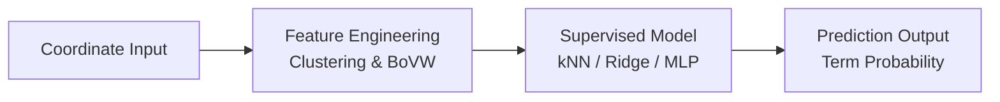

# NOUS-E2I

**Neuroscience Open-source Unified System — Emotion to Inference**

> **More than a replica—an evolution of the classic.**
>
> This project reproduces the core functionalities of Neurosynth while addressing its statistical limitations through **Machine Learning Decoding**, all presented within a fully modernized user interface.

[Explore Docs »](#-about-the-project) · [🌐 Live Demo](https://shihyun-lin.github.io/NOUS-E2I/)

<br />

## Table of Contents

1. [Project Core: Reproduction & Improvement](#-project-core-reproduction--improvement)
2. [About The Project](#-about-the-project)
3. [What is Neurosynth?](#-what-is-neurosynth)
4. [Core Improvement: Machine Learning Decoding](#-core-improvement-machine-learning-decoding)
5. [Project Architecture](#-project-architecture)
6. [Module Overview](#-module-overview)
7. [Getting Started](#-getting-started)
8. [Tech Stack](#-tech-stack)
9. [License](#️-license)

---

## 🎯 Project Core: Reproduction & Improvement

This project is not merely a clone of Neurosynth. Building upon the **reproduction of classic features**, we have implemented significant **improvements and optimizations** to address existing pain points.

| Aspect | 🔄 Reproduction | ✨ Improvement |
| :--- | :--- | :--- |
| **Core Algorithm** | Replicated the **ETL Pipeline** for extracting fMRI coordinates from literature. | **ML Decoding** (Module 03): Abandoned simple linear correlation coefficients in favor of supervised learning (kNN/Ridge/MLP) to handle non-linear features. |
| **Inference Logic** | Implemented concepts of Forward and Reverse Inference. | **Validation Mechanism**: Introduced K-Fold Cross-Validation to provide a more rigorous assessment of model generalizability compared to traditional statistical tests. |
| **User Interface** | Provided basic query functionality. | **NOUS Frontend** (Module 06): Built a modern interface using React + Vite, integrating **3D NIfTI Brain Visualization** to significantly enhance interactivity and user experience. |

---

## 📖 About The Project

> This project is the final implementation for the **Psychoinformatics & Neuroinformatics (PSY5261)** course at National Taiwan University.

**NOUS-E2I** is a full-stack research platform for **Meta-Analysis** of fMRI literature. Integrating data engineering, machine learning, and full-stack development, it aims to resolve the limitations of traditional meta-analysis tools regarding "inference specificity" and "interactivity."

**Key Functional Modules:**
- 🔤 **Text Analysis** (LIWC Nano)
- 📊 **Automated Literature Mining** (Neurosynth ETL)
- 🧠 **AI-Driven Functional Decoding** (ML Decoding)
- 🔍 **Functional Dissociation Query** (Dissociation API)
- 🎯 **3D Interactive Visualization** (React Frontend)

---

## 🔬 What is Neurosynth?

[Neurosynth](https://neurosynth.org/) is an open-source online platform designed for the large-scale, automated synthesis of fMRI data. It solves a core problem in neuroscience: **How to infer "functional specificity" from a vast body of literature?**

### How Classic Neurosynth Works
- **Forward Inference**: "When a subject feels pain, where does the brain light up?" (Uniformity Test)
- **Reverse Inference**: "When the anterior insula lights up, what is the probability that it is due to pain?" (Association Test)

Neurosynth achieves this by calculating the **Pearson Spatial Correlation** between input brain maps and term-based brain maps in its database—a major breakthrough in the field.

---

## 🚀 Core Improvement: Machine Learning Decoding

While Neurosynth's correlation method is classic, we identified its limitations during our coursework and implementation. Therefore, **Module 03** of this project focuses on **methodological innovation**.

### 1. Pain Points Analysis

- **❌ Inability to Handle Non-Linear Superposition**:
  Correlation coefficients only measure linear relationships. For example, "Visual Planning" + "Auditory Planning" might spatially equal "Audio-Visual Integration," but correlation cannot distinguish whether this is a simple sum of two functions or a distinct integrated function.

- **❌ Limitations of Group Inference**:
  Neurosynth maps are based on averages from massive studies (Group Inference). Their accuracy is limited when predicting for a single coordinate or study (Sample Inference).

- **❌ Lack of predictive models**:
  Pearson correlation is a **descriptive statistic** (How similar are these two maps?), not a **predictive model** (Which category does this map belong to?).

### 2. Our Solution: Supervised Machine Learning

We transformed the problem from "calculating similarity" to "training a classifier."



- **Feature Engineering**: Clustered 500k+ coordinates into 250 spatial feature groups (Clusters).
- **Supervised Learning**: Trained models to learn the **non-linear mapping** between coordinate distributions and term labels.
- **Model Selection**:
    - **kNN**: Captures local geometric structure.
    - **Ridge Regression**: Handles multicollinearity.
    - **MLP (Neural Network)**: Captures complex non-linear features.

### 3. Empirical Results
By introducing machine learning, we provide not just correlation scores but **prediction probabilities**, ensuring model validity on unseen data through cross-validation.

---

## 🏗 Project Architecture

```
NOUS-E2I/
├── 01-text-liwc-nano          # [Basic] Sentiment Analysis Tool
├── 02-data-neurosynth-etl     # [Repro] Automated Literature ETL Pipeline
├── 03-ml-neurosynth-decoding  # [Improv] ML Decoding Core (ML vs Pearson)
├── 04-api-neurosynth-backend  # [Repro] Functional Dissociation API Backend
├── 05-web-neurosynth-frontend # [Repro] Classic Query Interface Replica
└── 06-web-nous-frontend       # [Improv] Modern React + 3D NIfTI Visualization Platform
```

---

## 📦 Module Overview

### 01 — Text Analysis (`01-text-liwc-nano`)
**Function**: Implements basic sentiment analysis capabilities.
- Implements tokenizer and wildcard (`*`) matching algorithms.
- Provides validation scripts to ensure consistency with official results.

### 02 — Data ETL (`02-data-neurosynth-etl`)
**Reproduction**: Replicates the Neurosynth workflow for scraping and parsing tables from PubMed/PMC.
- Utilizes LLM to assist in parsing complex tables, improving coordinate extraction accuracy.

### 03 — Machine Learning Decoding (`03-ml-neurosynth-decoding`)
**Improvement**: The core algorithmic upgrade of this project.
- Implements K-Means Clustering and BoVW (Bag-of-Visual-Words).
- Provides multiple Decoders (kNN, Ridge, MLP) for comparative analysis.

### 04 — Backend API (`04-api-neurosynth-backend`)
**Reproduction**: Provides standard "Functional Dissociation" queries.
- Supports `A \ B` (Mentioning A but NOT B) logic operational API.

### 05 — Static Frontend (`05-web-neurosynth-frontend`)
**Reproduction**: Lightweight term search interface.
- Implements real-time search and Co-occurrence display.

### 06 — React Frontend (`06-web-nous-frontend`)
**Improvement**: Builds a modern research workstation.
- **3D Visualization**: Integrates NiiVue for direct in-browser 3D brain map manipulation.
- **Bookmark System**: Supports local storage for research notes.
- **Interactivity**: locating coordinates in the 3D brain map by clicking on study tables.

---

## 🚀 Getting Started

### Prerequisites
- **Python**: 3.10+
- **Node.js**: 18+ (Frontend modules)
- **PostgreSQL**: 12+ (Backend API)

### Quick Start
```bash
# Clone the repository
git clone https://github.com/shihyun-lin/NOUS-E2I.git
cd NOUS-E2I

# Experience the core improvement (ML Decoding)
cd 03-ml-neurosynth-decoding
pip install -r requirements.txt
jupyter notebook neurosynth_MLdecoding.ipynb
```

---

## 🛠 Tech Stack

| Layer | Technologies |
| :--- | :--- |
| **Text Analysis** | Python, LIWC Dictionaries |
| **Data Pipeline** | BeautifulSoup, Pandas, OpenAI/Gemini APIs |
| **Machine Learning** | scikit-learn, NiMARE, FLAML (AutoML) |
| **Backend** | Flask, SQLAlchemy, PostgreSQL |
| **Frontend** | React 19, Vite, Tailwind CSS, NiiVue (WebGL) |

---

## ⚖️ License

Distributed under the MIT License. See `LICENSE` for more information.

---

## 👤 Author

**Shih-Yun Lin**
- GitHub: [@shihyun-lin](https://github.com/shihyun-lin)
